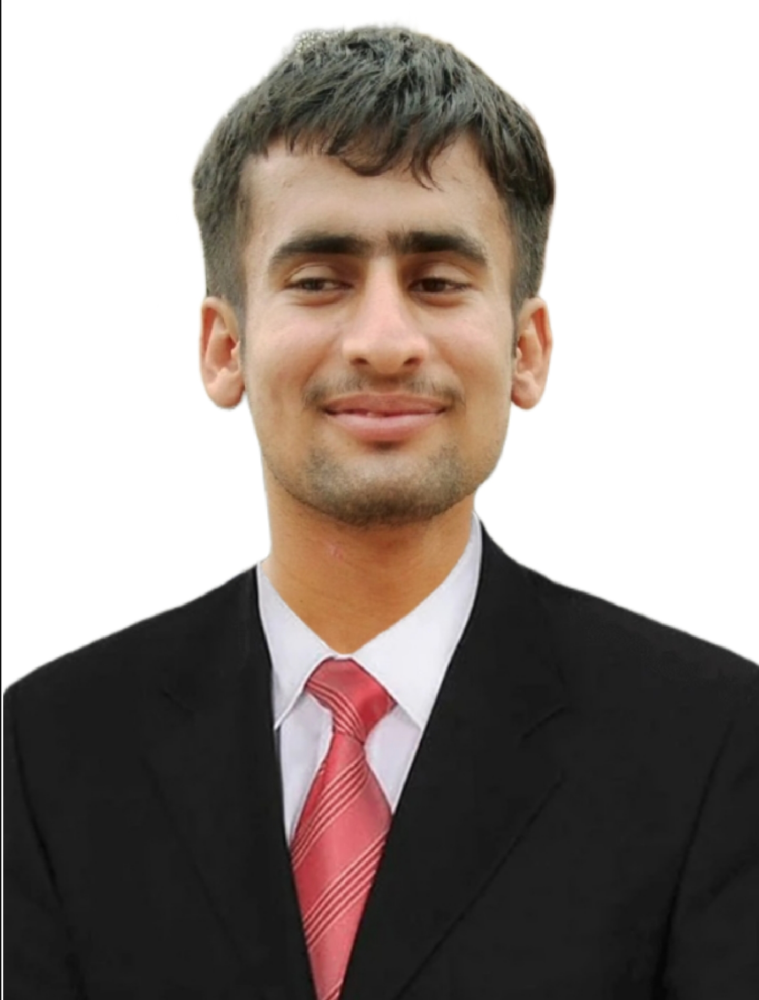

# Welcome to the page YasirAbbas

#### Image me

#### Personal Statement
To pursue my career as an outstanding professional in a challenging and dynamic environment where I can develop and boost my skills by complementing technical knowledge with practical experience. I like to be hard-working and try my best to be reliable in
my daily business. I spent a challenging life and resulting enjoyed to overcoming these challenges which developed my confidence. I prefer to be consistent in the goals that I set for myself

---
#### Introduction
I have completed a BSc in Agricultural Engineering at the University of Agriculture Faisalabad. I am working on remote sensing and GIS. I have completed an internship in the Agriculture Remote Sensing Lab hosted by the University of Agriculture Faisalabad. First of all, I learned about the Arc GIS software. I collected soil samples throughout the district of Chiniot in Pakistan. After I determined the  pH and EC of the soil. I made maps on Arc GIS. 

---
#### 🎓 Education

**Bachelor in Agricultural Engineering**  
_University of Agriculture Faisalabad, Pakistan_  

**Fsc. Pre-Engineering**  
_Govt. Higher Secondary Schoool Bhawana_  

**Matric Science**  
_Govt. High School Adlana Tehsil Bhawana District Chiniot_ 

---

#### Summer School Participation Online
**School on Strategies for Adapting to and Mitigating the Effects of
Climate Change in the Agricultural Sector**

_Universitat de VicUniversitat Central de Catalunya_

_24,25,26 April 2024_

---
#### Fellowship Programs
**Amal Career Prep Fellow** 

_Amal Academy education startup funded by Stanford University that teaches professional skills to students and corporations_

_August 2023- November 2023_

**OMLAS Fellow**

_OMLAS - One Million Leaders Asia_ I enhanced my leadership and professional capabilities.

_April 2023-November 2023_

---
#### Research Project
**Geospatial Modeling For Reconstructing High-Resolution (1Km) Groundwater Quality Data- Scarce Agro-Urbanized Regions in Punjab, Pakistan**
- This study aims to bridge this gap by leveraging remote sensing and advanced geospatial models to predict groundwater quality indicators (SAR, RSC, EC) at a fine resolution of 1 km² in Punjab, Pakistan. The research objectives encompass model development, evaluation, and uncertainty quantification to ensure reliable predictions. In this study, we used machine learning models like SVM, LRM, RF and XGBoost models for prediction results.

**To determine the Ec and pH of District Chiniot by using Arc GIS**

- In this research project to determine the EC and Ph of district Chiniot. Firstly, I collected soil samples of Chiniot and then made maps by Arc GIS.

---
#### Publication
- Abbas, Y., & Aslam, R. A. (2023). Potential of Untapped Renewable Energy Resources in Pakistan: Current Status and Future Prospects. Engineering Proceedings, 56(1), 108. (Published) [Link](https://www.mdpi.com/2673-4591/56/1/108)

- Abbas, Y., *Khan, S. N., Arshad,A., Zahid, H., & Aslam, R. A.(2024). Geospatial modeling of groundwater system for sustainable management: A review, Submitted full chapter to Springer Nature

---
#### Published Abstracts
- *Abbas, Y., Khan, S.H., & Zaman, M., (2024) Integration of Remote Sensing and Advanced Crop Models to Improve Crop Yield Estimations: a review. International Conference on “Geo-Informatics for Water and Agricultural Resource Management (ICGW ARW)” Organized by Agricultural Remote Sensing Lab, UAF
- *Abbas, Y., & Zahra, B.E., (2024) Role of Geo-informatics for Predicting Extreme Climate Changes. International Conference on “Geo-Informatics for Water and Agricultural Resource Management(ICGW ARW)” Organized by Agricultural Remote Sensing Lab, UAF
- *Abbas, Y., Khan N.S., Ammar Aslam, R., Arslan, C., Farid, M. U., Iqbal, M., & Mehboob, A. (2023). Scope of HBV hydrological model in flood forecasting. International conference on precision and Sustainable Agriculture under Climate Change(IPSAC-2023). Khwaja Fareed University of Engineering and Information Technology (KFUEIT), Rahim Yar Khan, Pakistan. IPSAC-109
- Aslam R. A., *Abbas Y. (2023). Suggesting options for sustainability of food production in Pakistan: Lessons from across the world. The 4th International Electronic Conference on Applied Sciences. sciforum-076506
- *Abbas, Y., & Faheem, M., (2023). Sustainable options to minimize postharvest losses in Pakistan. Alliance for Modernizing African Agrifood Systems. Imagining African Agrifood Systems: Looking Forward. ASABE Engineering is Sustainable Future
- *Abbas, Y., Faheem, & Ghous, B. (2023). Robotic Weed Control and Crop Improvement for Pakistan’s Sustainable Agriculture.  3rd International Conference on Scientific and Academic Research(ICSAR). AS-Proceedings, ISBN: 978-625-6530-75-1
- *Abbas, Y., Khan, N.S., Saeed, R. M. A., Wardah and Saeed N. (2023). Development of modern poultry farm in Pakistan. International Conference on Sustainable Food Security Solutions CPEC consortium of universities, Hosted by Department of Agronomy (UAF), IAEE & RD (UAF) and ISHU, University of Karachi

---
#### Conferences/Training Workshops / Webinars Attended
- One day CPD activity on “ How to Write an Effective Student Research Proposal & Thesis/ Final Year Project Report” (1.0 CPD point) Organized by Department of  Energy Systems Engineering, UAF on 10 January 2024
- International Conference on “Fodder Production in Climate Shift Paradigm: Better Nutrition for Better Dairy Production” Institute of Plant Breeding and Biotechnology, MNS University of Agriculture, Multan.  Attended virtually on 29-30 November 2023
- The international virtual conference on “Alliance for Modernizing African International Conference “Agrifood Systems Conference Imagining African Agrifood Systems: Looking Forward” ASABE American Society of Agricultural and Biological Engineers. Attend virtually on 14-17 November 2023
- Workshop on “Hands-on Experience on Developing CubeSats: From Satellite to Classroom-Based Educational Tool”(1.0 CPD point) Dept. of Irrigation  and Drainage, UAF on 09 February 2023
- Two days Hands on CPD training workshop “3-D Scanning and Printing for Design of Agricultural Machinery”(1.0 CPD point) Dept. of  Farm Machinery and Power, UAF on 18-19 May 2023
- Two days CPD training workshop on “Conceptual Hydrological Modelling” Dept. of Structures and Environmental Engineering, UAF on 23-24 January 2023
- 2 hour  Movers virtual workshop on “Climate Action Level 2” on 13 August 2022 
- 2 hour Movers virtual workshop on ‘SDG13: Climate Action Level 1” on 31 July 2022
- One day seminar on “Mechanical Rice Transplanting And Practical De’monstration of Kubota Rice Transplanter“(1.0 CPD point) Dept. of  Farm Machinery and Power, UAF on 20 July 2022
- One day PEC-CPD training workshop on “Waste-To-Energy Technologies”(1.0 CPD point) Dept. of Structures and Environmental Engineering, UAF on 24 May 2022
- One day International seminar & training workshop on “World Water Day 2022”(1.0 CPD point) Dept. of Irrigation  and Drainage, UAF on 30 March 2022

---
#### Presentation
- GIS Uses for Monitoring Soil Quality in Chiniot and Assessing pH and EC for Crop Productivity. Poster Presented at International Conference on “Geo-Informatics for Water and Agricultural Resource Management(ICGW ARW)” Organized by Agricultural Remote Sensing Lab, UAF on 24-26 April 2024  [Link](img/Yasir Abbas poster presentation.pdf)
- Sustainable Options to Minimize Postharvest Losses in Pakistan Presented in Conference Alliance for Modernizing African Agrifood Systems. Imagining African Agrifood Systems: Looking Forward. ASABE Engineering is Sustainable Future on 15 November 2023
- Improving Fodder Processing and Conservation Techniques for Sustainable Livestock Nutrition and Agricultural Productivity in Pakistan. Presented in International Conference on Fodder Production in Climate Shift Paradigm: Better Nutrition for Better Dairy Production Institute of Plant Breeding and Biotechnology, MNS University of Agriculture, Multan on 29 November 2023

 

#### Contact Information
* [Gmail](yasirabbasuaf@gmail.com)
* [LinkedIn](https://www.linkedin.com/in/chyasirabbas)
* [GitHub](https://github.com/chyasirabbasjutt)
